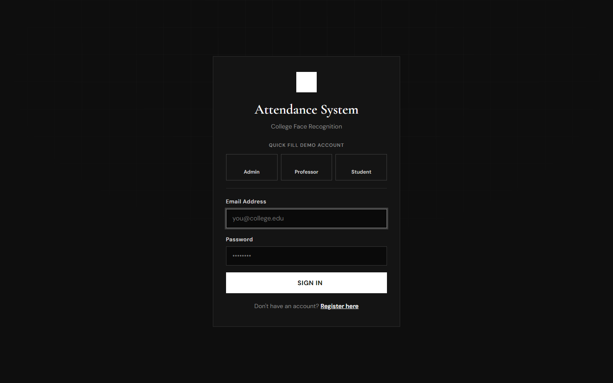
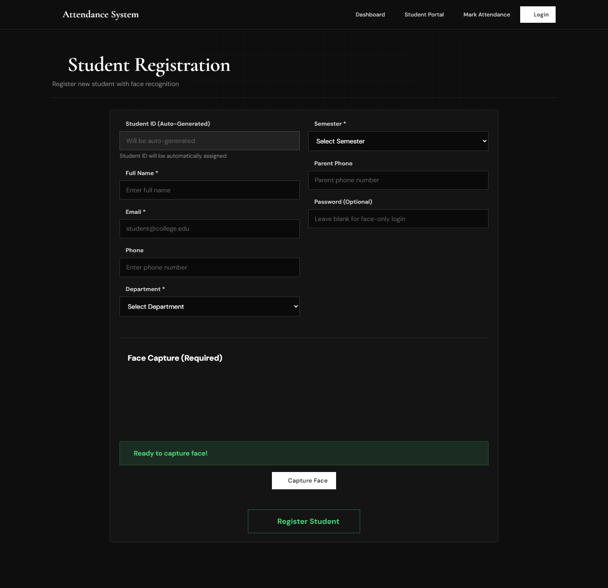
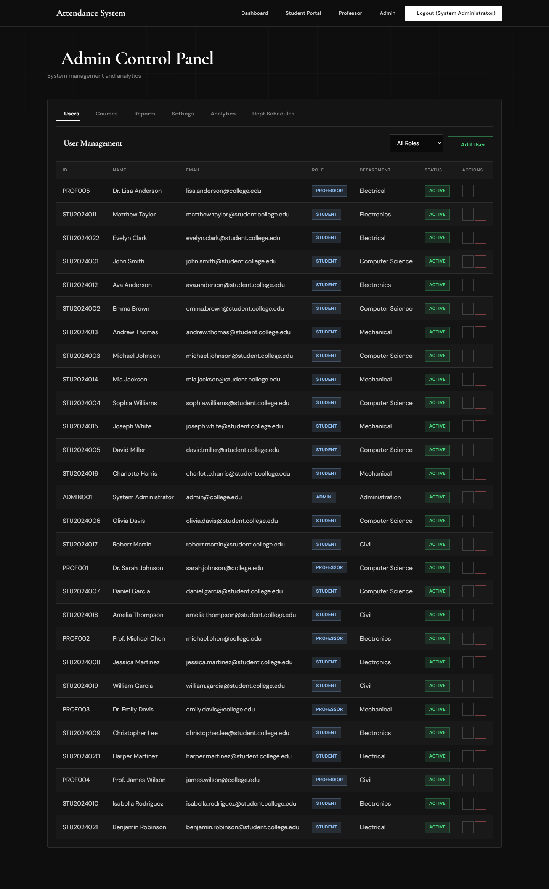
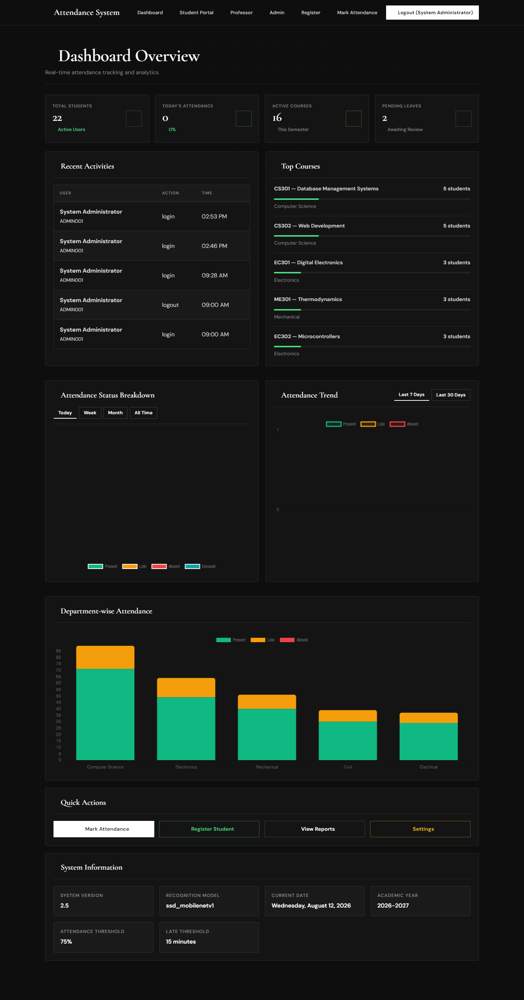
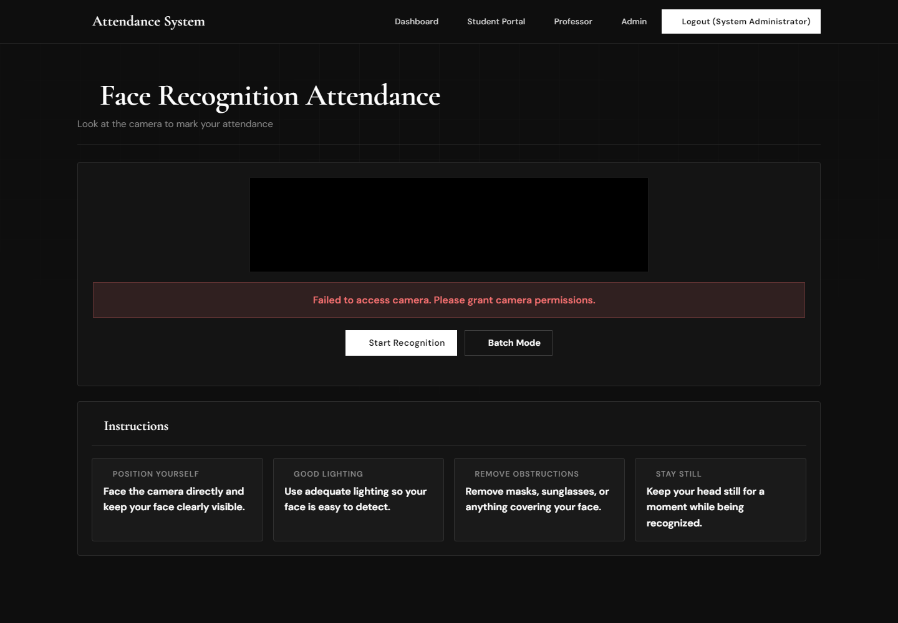
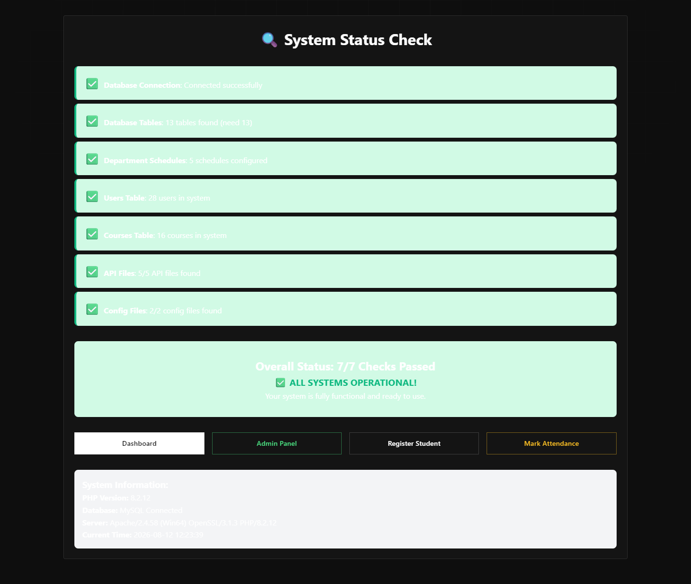
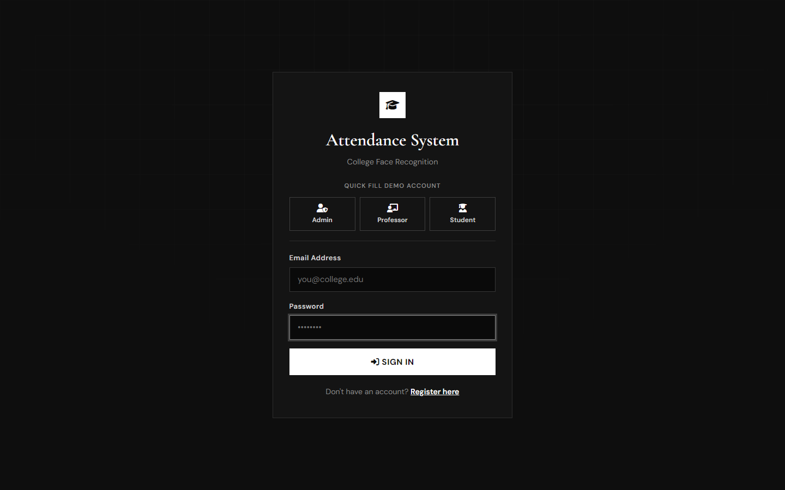
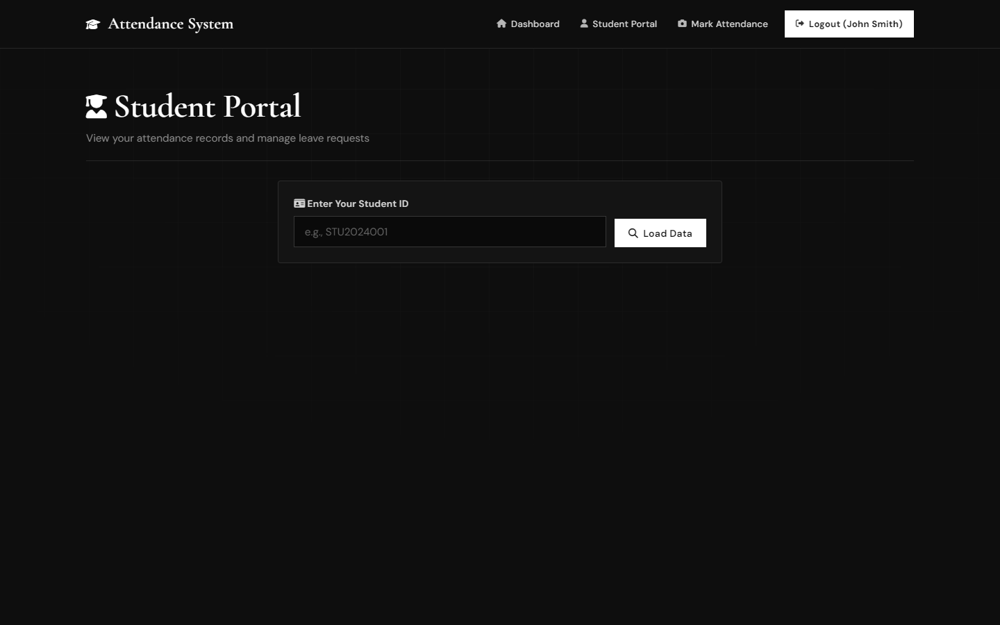

# College Face Recognition Attendance System v2.5

A comprehensive, production-ready college attendance management system with advanced face recognition technology, real-time analytics, and a dark editorial UI.


## Screenshots

Dark high-contrast interface inspired by premium editorial layouts — black canvas, white primary actions, and serif display headings.

### Login


### Register


### Admin Control Panel


### Main Dashboard


### Face Recognition / Mark Attendance


### System Check


### Professor Dashboard


### Student Portal


## Features

### 🔐 Advanced Face Recognition
- **SSD MobileNetV1** detector for 87% accuracy in real-world conditions
- 68-point facial landmark detection
- 128-dimensional face descriptors
- Dual-metric matching (Euclidean + Cosine similarity)
- Multi-descriptor storage (up to 3 face samples per person)
- Real-time quality checks (face size, angle, blur detection)
- Batch mode for multiple students

### 📚 Academic Management
- **Per-Lecture Attendance**: Track attendance for each class session
- **Course Enrollment**: Semester-based student enrollment system
- **Timetable Management**: Weekly recurring schedule with conflict detection
- **Leave Management**: Online applications with approval workflow
- **Real-time Analytics**: Live dashboard updates and statistics

### 👥 User Role System
- **4 Role Types**: Student, Professor, Admin, HOD
- **Role-Based Access**: Different interfaces and permissions
- **Department Organization**: Organized by academic departments

### 📊 Reports & Analytics
- **7+ Report Types**: Summary, Student, Course, Department, Daily, Defaulters, Export
- **Visual Charts**: Interactive graphs with Chart.js
- **Data Export**: CSV format for external analysis
- **Real-time Statistics**: Live updates every 30 seconds

### ⚠️ Warning System
- **4 Warning Levels**: Based on attendance percentage
- **Automated Detection**: Real-time monitoring
- **Email Alerts**: Notifications to students and parents
- **Defaulter Management**: Identify at-risk students

### 🔔 Notification System
- **Real-Time Alerts**: Instant notifications
- **Priority Levels**: Critical, high, medium, low
- **Email Integration**: Automated email notifications
- **Parent Portal**: Parent access with unique codes

## 🛠️ Technology Stack

### Backend
- **PHP 8+** with PDO for secure database operations
- **MySQL 5.7+** for robust data storage
- **RESTful API** architecture with 12+ endpoints
- Apache Server (XAMPP environment)

### Frontend
- **HTML5, CSS3, JavaScript ES6+**
- **Bootstrap 5** responsive framework
- **Font Awesome 6** modern icons
- **Chart.js** for data visualization
- **face-api.js** for face recognition

### Face Recognition
- SSD MobileNetV1 detector
- 68-point facial landmarks
- 128-dimensional descriptors
- Real-time preprocessing

## 📋 System Requirements

### Server Requirements
- **PHP**: 8.0 or higher
- **MySQL**: 5.7 or higher
- **Apache**: 2.4 or higher
- **RAM**: Minimum 2GB (4GB recommended)
- **Storage**: Minimum 500MB free space

### Client Requirements
- **Modern Browser**: Chrome, Firefox, Safari, or Edge (latest version)
- **Webcam**: Built-in or external camera
- **Internet Connection**: For face-api.js library
- **Screen Resolution**: Minimum 1280x720

## 🚀 Installation Guide

### Step 1: Install XAMPP

1. Download XAMPP from [https://www.apachefriends.org](https://www.apachefriends.org)
2. Install XAMPP to `C:\xampp` (Windows) or `/Applications/XAMPP` (Mac)
3. Start Apache and MySQL from XAMPP Control Panel

### Step 2: Setup Database

1. Open phpMyAdmin: [http://localhost/phpmyadmin](http://localhost/phpmyadmin)
2. Click "Import" tab
3. Choose file: `database/schema.sql`
4. Click "Go" to import

**Alternative: Manual Creation**
```sql
-- Open phpMyAdmin SQL tab and paste:
-- Copy content from database/schema.sql
```

### Step 3: Configure Database Connection

1. Open `config/database.php`
2. Update credentials if needed (default works for XAMPP):

```php
define('DB_HOST', 'localhost');
define('DB_USER', 'root');
define('DB_PASS', '');  // Leave empty for XAMPP default
define('DB_NAME', 'attendance_system');
```

### Step 4: Deploy Files

1. Copy all project files to XAMPP's htdocs folder:
   - **Windows**: `C:\xampp\htdocs\attendance2\`
   - **Mac**: `/Applications/XAMPP/htdocs/attendance2/`

### Step 5: Set Permissions (Optional for production)

**Linux/Mac:**
```bash
chmod 755 -R attendance2/
chmod 777 -R attendance2/assets/
chmod 777 -R attendance2/uploads/  # If using file uploads
```

### Step 6: Access the System

1. Open browser and navigate to:
   - **Main Dashboard**: [http://localhost/attendance2/](http://localhost/attendance2/)
   - **Student Portal**: [http://localhost/attendance2/student_portal.php](http://localhost/attendance2/student_portal.php)
   - **Professor Dashboard**: [http://localhost/attendance2/professor_dashboard.php](http://localhost/attendance2/professor_dashboard.php)
   - **Admin Panel**: [http://localhost/attendance2/admin.php](http://localhost/attendance2/admin.php)

### Step 7: Default Login

**Admin Account** (already created in database):
- **User ID**: ADMIN001
- **Email**: admin@college.edu
- **Password**: admin123
- **Role**: Administrator

## 📖 User Guide

### For Students

#### 1. Register in System
- Navigate to Registration page
- Fill in personal details
- Capture face (3 samples recommended)
- Submit form
- Note your Parent Access Code

#### 2. Mark Attendance
- Go to Face Recognition page
- Click "Start Recognition"
- Look at camera for 2-3 seconds
- Attendance marked automatically

#### 3. View Attendance
- Go to Student Portal
- Enter your Student ID
- View statistics and records
- Apply for leave if needed

### For Professors

#### 1. Add Course
- Login to Professor Dashboard
- Go to "My Courses" tab
- Click "Add Course"
- Fill course details
- Save

#### 2. Schedule Lectures
- Go to "Lectures" tab
- Click "Schedule Lecture"
- Select course, date, time
- Add topic and room number
- Save

#### 3. Mark Attendance
- Go to "Mark Attendance" tab
- Select course and date
- Mark students present/absent
- Submit attendance

#### 4. Review Leave Requests
- Go to "Leave Requests" tab
- View pending requests
- Approve or reject with comments

### For Administrators

#### 1. Manage Users
- Login to Admin Panel
- Go to "Users" tab
- Add/Edit/Delete users
- Assign roles

#### 2. Manage Courses
- Go to "Courses" tab
- Add new courses
- Assign professors
- Track enrollments

#### 3. Generate Reports
- Go to "Reports" tab
- Select report type
- Choose date range
- Generate and export

#### 4. Configure System
- Go to "Settings" tab
- Update attendance rules
- Configure face recognition
- Enable/disable notifications

## 🔧 Configuration Options

### System Settings (Admin Panel → Settings)

#### Attendance Settings
- **Start Time**: Default attendance start time (e.g., 09:00 AM)
- **End Time**: Default attendance end time (e.g., 05:00 PM)
- **Late Threshold**: Minutes after which marked as late (default: 15)
- **Minimum Attendance**: Required percentage (default: 75%)

#### Face Recognition Settings
- **Recognition Threshold**: 0.3-0.8 (default: 0.6)
  - Lower = More strict matching
  - Higher = More lenient matching
- **Detection Model**: SSD MobileNetV1 (recommended)

#### Warning Levels
- **Level 1**: 85% attendance
- **Level 2**: 80% attendance
- **Level 3**: 75% attendance (critical)

#### Notifications
- **Email Notifications**: Enable/Disable
- **Parent Notifications**: Enable/Disable

## 📁 Project Structure

```
attendance2/
├── api/                      # API Endpoints
│   ├── register.php         # Student registration
│   ├── mark_attendance.php  # Attendance marking
│   ├── stats.php            # Statistics
│   ├── users.php            # User management
│   ├── attendance.php       # Attendance records
│   ├── lectures.php         # Lecture management
│   ├── enrollment.php       # Course enrollment
│   ├── leave_requests.php   # Leave management
│   ├── notifications.php    # Notifications
│   ├── reports.php          # Reports & analytics
│   └── courses.php          # Course management
├── assets/
│   └── css/
│       └── style.css        # Main stylesheet
├── config/
│   ├── database.php         # Database configuration
│   └── helpers.php          # Helper functions
├── database/
│   └── schema.sql           # Database schema
├── index.php                # Main dashboard
├── student_portal.php       # Student interface
├── professor_dashboard.php  # Professor interface
├── admin.php                # Admin panel
├── face_recognition.php     # Attendance marking
├── register.php             # Registration form
└── README.md                # This file
```

## 🎯 API Endpoints

### Authentication
- `POST /api/register.php` - Register new user with face
- `POST /api/mark_attendance.php` - Mark attendance via face recognition

### User Management
- `GET /api/users.php` - Get users list
- `POST /api/users.php` - Create user
- `PUT /api/users.php` - Update user
- `DELETE /api/users.php` - Delete user

### Attendance
- `GET /api/attendance.php` - Get attendance records
- `POST /api/attendance.php` - Manual attendance marking
- `GET /api/stats.php` - Get statistics

### Course Management
- `GET /api/courses.php` - Get courses
- `POST /api/courses.php` - Create course
- `PUT /api/courses.php` - Update course

### Lecture Management
- `GET /api/lectures.php` - Get lectures
- `POST /api/lectures.php` - Schedule lecture
- `PUT /api/lectures.php` - Update lecture

### Leave Management
- `GET /api/leave_requests.php` - Get leave requests
- `POST /api/leave_requests.php` - Submit leave request
- `PUT /api/leave_requests.php` - Approve/Reject leave

### Reports
- `GET /api/reports.php?type=summary` - Summary report
- `GET /api/reports.php?type=defaulters` - Defaulters list
- `GET /api/reports.php?type=department` - Department report
- `GET /api/reports.php?type=daily` - Daily report

## 🐛 Troubleshooting

### Face Recognition Not Working

**Issue**: Camera not accessible
- **Solution**: Grant camera permissions in browser
- Check browser settings → Privacy → Camera

**Issue**: Models not loading
- **Solution**: Check internet connection
- face-api.js requires CDN access

**Issue**: Face not recognized
- **Solution**: 
  - Ensure good lighting
  - Face camera directly
  - Remove obstructions (mask, sunglasses)
  - Re-register if appearance changed significantly

### Database Connection Failed

**Issue**: "Database connection failed"
- **Solution**: 
  - Check if MySQL is running in XAMPP
  - Verify database credentials in `config/database.php`
  - Ensure database `attendance_system` exists

### Attendance Already Marked

**Issue**: "Attendance already marked for today"
- **Solution**: This is intentional - one attendance per day
- To re-mark, manually edit in Admin Panel

### Poor Recognition Accuracy

**Issue**: Wrong person recognized
- **Solution**:
  - Lower recognition threshold in Admin Settings (e.g., 0.4)
  - Capture more face samples during registration
  - Ensure good lighting during registration

## 🔐 Security Features

1. **Face Data Protection**: Only mathematical descriptors stored, no images
2. **SQL Injection Prevention**: PDO prepared statements
3. **Input Validation**: Comprehensive sanitization
4. **Role-Based Access**: Secure permission system
5. **Audit Trail**: Complete activity logging
6. **GDPR Ready**: Data export and deletion capabilities

## 📊 Database Schema

### 12 Core Tables
1. **user_roles** - User role definitions
2. **users** - Student, professor, admin data
3. **courses** - Course information
4. **semesters** - Academic semesters
5. **course_enrollment** - Student enrollments
6. **lectures** - Scheduled lectures
7. **attendance** - Daily attendance records
8. **lecture_attendance** - Per-lecture attendance
9. **leave_requests** - Leave applications
10. **notifications** - System notifications
11. **attendance_logs** - Audit trail
12. **system_settings** - Configuration

## 🎨 Customization

### Changing Colors

Edit `assets/css/style.css`:
```css
:root {
    --primary-color: #6366f1;     /* Change to your color */
    --secondary-color: #8b5cf6;
    --success-color: #10b981;
    --warning-color: #f59e0b;
    --danger-color: #ef4444;
}
```

### Adding Departments

Edit registration forms and add to dropdown:
```html
<option value="Your Department">Your Department</option>
```

### Modifying Attendance Rules

Admin Panel → Settings tab → Update values

## 📈 Performance Tips

1. **Database Indexing**: Pre-configured for optimal performance
2. **Browser Caching**: Static assets cached automatically
3. **Query Optimization**: Efficient SQL queries used
4. **Memory Management**: Optimized face recognition processing

## 🤝 Support & Contribution

### Getting Help
- Check documentation thoroughly
- Review troubleshooting section
- Check browser console for errors

### Contributing
Contributions welcome! Please:
1. Fork the repository
2. Create feature branch
3. Test thoroughly
4. Submit pull request

## 📝 License

This project is licensed under the MIT License.

## 🙏 Acknowledgments

- **face-api.js** - Face recognition library
- **Chart.js** - Data visualization
- **Font Awesome** - Icons
- **Bootstrap** - UI framework

## 📧 Contact

For support or inquiries:
- **Project**: College Face Recognition Attendance System
- **Version**: 2.0
- **Email**: admin@college.edu

## 🎉 Version History

### Version 2.0 (Current)
- ✅ Enhanced face recognition (87% accuracy)
- ✅ Per-lecture attendance tracking
- ✅ Advanced analytics and reporting
- ✅ Leave management system
- ✅ Parent portal integration
- ✅ Notification system
- ✅ Modern UI with animations
- ✅ Batch attendance mode
- ✅ Role-based access control

### Version 1.0
- Basic face recognition
- Simple attendance marking
- Basic reporting

---

**🎓 Ready to revolutionize your college attendance management!**

**⭐ If you found this system helpful, please star the repository!**

